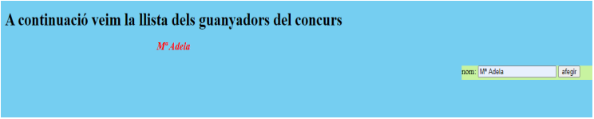

# Actividades repaso JavasCript

1- Crea una pàgina web que tengui el següent codi html:

```html
...
<body>
  <main>
    <h1>Llista dels nostres guanyadors del día:"</h1>
  </main>
  <aside>
    <!--aquí anirà el formulari-->
  </aside>
</body>
```

- El formulari ha de demanar el nom del participant, la seva direcció, i la població on viu.
- Després crea una funció JS que permeti afegir el nom a la pàgina com a paràgraf <p> dins del main,
  després del < h1 >
- Amb CSS, col·loca bé el formulari

Podriem veure la pàgina amb un aspecte similar a:


2- Fes una funció js que permeti calcular la nota d'un alumne.

Les dades de l'alumne han d'estar a un formulari:

- Nom alumne:
- Nota primera avaluació
- Nota segona avaluació
- Nota final --> Que serà el promig de les dues notes anteriors. S'ha de calcular i escriure des de la funció.

3- Crear una funció que determini si un string introduït per un usuari comença per un número o una lletra.

4- A una pàgina web, els < p > tenen una clase anomenada "resaltar". Crea una funcio js que suprimeixi
aquesta classe dels paràgrafs i la assigni als < h4 > de la pàgina.
(hauràs de tenir una pàgina amb < p > amb classe i < h4 >sense classe.
